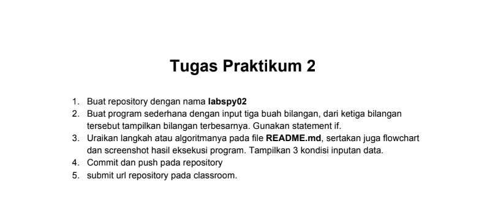
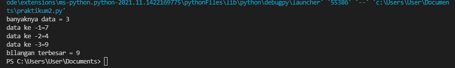

# tugas labspy02
## soal 

## jawab
untuk menjawab soal diatas disini saya membuat inputan terlebih dahulu

    a = int(input("Masukkan bilangan 1: "))
    b = int(input("Masukkan bilangan 2: "))
    c = int(input("Masukkan bilangan 3: "))

lalu masukan bilangan sesuai keinginan 
disini saya memasukan bilangan 1 yaitu 7 bilangan 2 yaitu 4 bilangan 3 yaitu 9

dibawah ini adalah flowchart yang dibuat

setelah itu masukan syntak berikut 

    N=int(input("banyaknya data = "))
    if N>0:
        i=1
        x=int(input("data ke -"+str(i)+"="))
        max=x;total=x
        for i in range(2,N+1):
            x=int (input("data ke -"+str(i)+"="))
            total+=x
            if max<x:
                max=x

        print("bilangan terbesar =",max)

yang akan menghasilkan output seperti dibawah ini 

